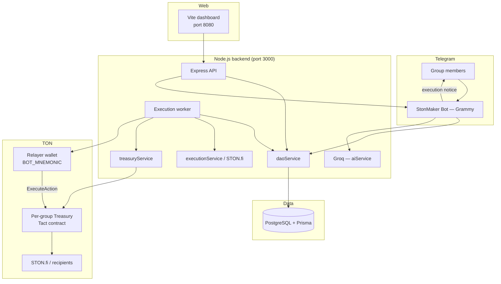
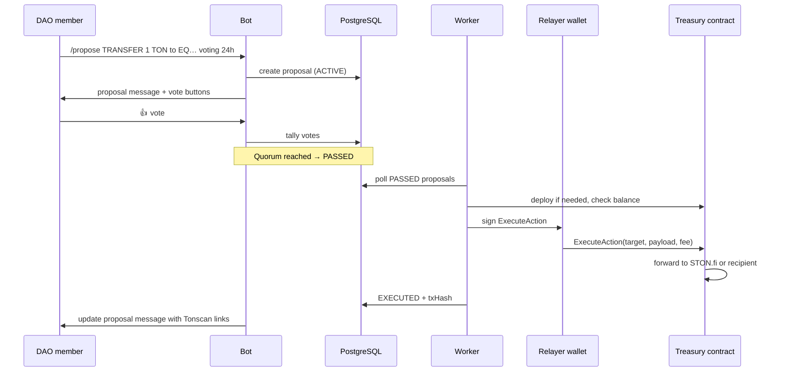

# StonMaker

**Check it out here:** [https://ston-maker.vercel.app/](https://ston-maker.vercel.app/)

**Telegram-native DAO bot on TON.** Turn any Telegram group into a mini-DAO with a shared treasury, member-gated proposals, quorum voting, and on-chain execution via a per-group smart contract.

Public dashboard: search any initialized group by `@username`, invite link, group name, or chat ID.

---

## Features

- **Group treasuries** — counterfactual TON smart contract per group; fund with TON/jettons
- **Membership gating** — `/join_dao` flow with admin approve/reject and per-group TON wallet linking
- **Natural-language proposals** — `/propose` parsed by Groq into structured SWAP, Add Liquidity (STAKE), or TRANSFER actions
- **Quorum voting** — inline Telegram buttons; configurable voting duration (`24h`, `2d`, `1w`, …)
- **On-chain execution** — background worker broadcasts passed proposals through the group Treasury contract
- **STON.fi integration** — swap and LP payloads built dynamically (mainnet routers; testnet transfers supported)
- **Web dashboard** — read-only treasury balance, members, proposals, and Tonscan links
- **Flexible group lookup** — dashboard search by chat ID, `@username`, invite link, or exact group title

---

## Architecture



### Request flow (proposal → execution)



### Two wallets (important)

| Wallet | Env vars | Role |
|--------|----------|------|
| **Relayer** | `BOT_WALLET_ADDRESS`, `BOT_MNEMONIC` | Signs `ExecuteAction`; pays gas only; must match treasury `owner` |
| **Treasury** | derived per group | Holds DAO funds; pays proposal amounts; address stable after first `/join_dao` |

Treasury address = `hash(BOT_WALLET_ADDRESS + internal groupId)`. **Do not change `BOT_WALLET_ADDRESS` after a group is created** or on-chain funds will not match the DB record.

---

## Project structure

```
StonMaker/
├── index.ts                 # Bot entrypoint + Express server
├── contracts/
│   └── treasury.tact        # Per-group treasury (ExecuteAction)
├── prisma/
│   ├── schema.prisma        # Users, groups, proposals, votes
│   └── migrations/
├── scripts/
│   └── deploymentService.ts # Counterfactual treasury address computation
├── src/
│   ├── aiService.ts         # Groq proposal intent parsing
│   ├── apiRoutes.ts         # REST API for dashboard
│   ├── daoService.ts        # Membership, proposals, voting
│   ├── db.ts                # Prisma + PostgreSQL adapter
│   ├── durationUtils.ts     # Voting duration parsing
│   ├── executionService.ts  # STON.fi swap/LP/transfer payloads
│   ├── formatters.ts        # HTML Telegram proposal messages
│   ├── groupLookup.ts       # Resolve @username / invite / name → chat ID
│   ├── stonfiServices.ts    # Jetton/router helpers
│   ├── tonNetwork.ts        # TON client, Tonscan URLs
│   ├── treasuryService.ts   # Deploy, balance, afford checks
│   └── workerService.ts     # On-chain execution loop
├── frontend/                # Vite + TanStack Router dashboard
│   ├── src/routes/          # Landing, dashboard, how-it-works
│   └── src/lib/api.ts       # API client
└── build/Treasury/          # Compiled Tact output (generated)
```

---

## Tech stack

| Layer | Technology |
|-------|------------|
| Bot | [Grammy](https://grammy.dev/), TypeScript, `tsx` |
| API | Express 5, CORS |
| Database | PostgreSQL ([Neon](https://neon.tech)), Prisma 7 |
| AI | Groq (proposal parsing) |
| Chain | TON testnet/mainnet, `@ton/ton`, Tact treasury contract |
| DEX | STON.fi SDK |
| Frontend | Vite 7, TanStack Router, Tailwind, shadcn/ui |

---

## Prerequisites

- **Node.js** 20+
- **pnpm** (recommended) or npm
- **PostgreSQL** database (e.g. Neon)
- **Telegram bot token** — [@BotFather](https://t.me/BotFather)
- **Groq API key** — [console.groq.com](https://console.groq.com)
- **TON relayer wallet** — testnet wallet with TON for gas (`TON_NETWORK=testnet`)
- **Compiled contracts** — run `pnpm run build:contract` before first execution

---

## Environment setup

### 1. Root `.env`

```bash
cp .env.example .env
```

| Variable | Description |
|----------|-------------|
| `BOT_TOKEN` | Telegram bot token |
| `BOT_USERNAME` | Bot username without `@` |
| `DATABASE_URL` | PostgreSQL connection string |
| `GROQ_API_KEY` | Groq API key for `/propose` parsing |
| `BOT_WALLET_ADDRESS` | Relayer wallet address (must match mnemonic) |
| `BOT_MNEMONIC` | 24-word relayer wallet mnemonic |
| `TON_NETWORK` | `testnet` (default) or `mainnet` |
| `FRONTEND_ORIGIN` | CORS origins, comma-separated (e.g. `http://localhost:8080`) |

### 2. Frontend `.env`

```bash
cp frontend/.env.example frontend/.env
```

| Variable | Description |
|----------|-------------|
| `VITE_API_URL` | Backend URL (`http://localhost:3000`) |
| `VITE_BOT_USERNAME` | For “Add to Telegram” link |
| `VITE_TON_NETWORK` | `testnet` or `mainnet` (Tonscan links) |

### 3. Database

```bash
pnpm install
pnpm run db:gen
pnpm run db:push      # dev / quick sync
# or
pnpm run db:migrate   # tracked migrations
```

After changing `prisma/schema.prisma`, always run `pnpm run db:gen` before `pnpm dev`.

---

## Running locally

### Install

```bash
pnpm install
cd frontend && pnpm install && cd ..
pnpm run build:contract   # first time only
```

### Bot + API

```bash
pnpm dev
```

- Bot: Grammy long-polling  
- API: `http://localhost:3000`  
- Worker: polls every 15s for `PASSED` proposals  

### Frontend only

```bash
pnpm run dev:frontend
```

Dashboard: **http://localhost:8080**

### Bot + frontend together

```bash
pnpm run dev:all
```

> **CORS:** set `FRONTEND_ORIGIN` to match your Vite port (`http://localhost:8080` by default).

---

## Telegram bot commands

| Command | Description |
|---------|-------------|
| `/start` | Welcome; in groups, syncs admin roles |
| `/help` | Command reference |
| `/join_dao` | Request DAO membership (admin approval) |
| `/treasury` | Show treasury contract address |
| `/balance` | Live TON balance of treasury |
| `/dashboard` | Chat ID and dashboard search hints |
| `/set_invite <link>` | **Admin:** save invite link for web search |
| `/propose <details>` | Create proposal (members only) |

**Proposal examples**

```
/propose TRANSFER 1 TON to EQ… voting 24h
/propose SWAP 10 TON for USDT voting 2d
/propose add liquidity 5 TON USDT voting 1w
```

If duration is omitted, the bot asks you to reply with e.g. `24h`.

**Wallet linking:** reply to the bot’s wallet prompt with your 48-character TON address (per group).

---

## Proposal lifecycle

| Status | Meaning |
|--------|---------|
| `ACTIVE` | Open for voting |
| `PASSED` | Quorum met; waiting for worker |
| `REJECTED` | Quorum failed or majority no |
| `EXECUTING` | Worker in progress |
| `EXECUTED` | On-chain tx broadcast; `txHash` stored |
| `FAILED` | Reserved for future use |

When a proposal executes, the bot updates the original Telegram message with **Tonscan** links (treasury, destination, transaction).

---

## Web dashboard

Open `/dashboard` and search using any of:

| Input | Example |
|-------|---------|
| Chat ID | `-1001234567890` (from `/dashboard`) |
| Group name | `Test StonPool` (exact title) |
| Public username | `@mygroup` or `mygroup` |
| Invite link | `https://t.me/+AbCdEf…` |

**Private groups:** an admin must run `/set_invite https://t.me/+…` once so the link is stored (the bot cannot read invite links unless it is a group admin).

---

## API reference

Base URL: `http://localhost:3000`

| Method | Path | Description |
|--------|------|-------------|
| `GET` | `/api/group/lookup?q=` | Resolve group → `{ chatId, groupName, telegramUsername }` |
| `GET` | `/api/group/:query/treasury` | Treasury address, balance, member count, quorum |
| `GET` | `/api/group/:query/proposals` | Active + recent proposals |

`:query` accepts the same formats as dashboard search (URL-encoded).

---

## Smart contracts

Treasury contract (`contracts/treasury.tact`):

- **`owner`** — relayer wallet; only caller allowed to execute
- **`ExecuteAction`** — forwards value + payload to STON.fi router or transfer target; pays relayer fee

Compile:

```bash
pnpm run build:contract
```

Output: `build/Treasury/`. The `predev` script auto-builds if missing.

---

## Build & test

```bash
pnpm run build              # Compile bot TypeScript → dist/
pnpm run build:contract     # Compile Tact contracts
pnpm run build:frontend     # Production dashboard build
pnpm test                   # Jest
```

---

## Deployment notes

1. Set all env vars on the host (Render, Fly, VPS, …).
2. Run `pnpm run db:push` or migrations against production Postgres.
3. Run `pnpm run build:contract` in CI or build step.
4. Use **one bot instance** per `BOT_TOKEN` (409 conflict if duplicated).
5. Set `FRONTEND_ORIGIN` to your production dashboard URL.
6. Fund the **relayer wallet** with TON on the chosen network; fund each **treasury** separately.
7. Prefer `testnet` until swap routers are configured for your network.

---

## Troubleshooting

| Issue | Fix |
|-------|-----|
| Dashboard “API not running” | Check CORS: `FRONTEND_ORIGIN` must match frontend URL (`http` not `https` locally) |
| `Unknown argument txHash` | Run `pnpm run db:gen` and restart bot |
| `409 Conflict getUpdates` | Stop duplicate bot processes (local + cloud) |
| Treasury address mismatch | Don’t change `BOT_WALLET_ADDRESS` after group creation |
| Invite link not found | Admin runs `/set_invite` in the group |
| Execution fails — no gas | Send testnet TON to relayer wallet |
| Execution fails — no funds | Send TON to treasury address from `/treasury` |

---

## License

All rights reserved. See repository owner for usage terms.
